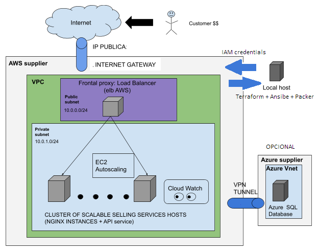

# Introduccio del projecte

### Link a la planificació del projecte: https://trello.com/b/Gn5vqlTJ/planning-del-projecte

## Descripció del projecte:

Prepararem un entorn per un event anual massiu, com ara la venta d'entrades per una final de la UEFA Champions League, on necessitarem dimensionar una infraestructura gran i alhora poder-la redimensionar.

Per realitzar i mantenir aquesta infraestructura ens acollirem a les eines de IaC (Infraestructura com a codi) recolzades per un proveidor al cloud.

Crarem un codi (amb Terraform) per detallar tots els recursos configurats que volem desplegar en el nostre proveidor (AWS). Aquesta infraestructura serà capaç de ser desplegada/aixecada i configurada (amb Packer i Ansible) X dies abans de l'event per mantenir un servidor web que alhora ofereixi servei web de venta d'entrades. (NOTA: el servei web no s'ha implementat)

Tot això oferint que els recursos que poden ser sobrecargats, tinguin escalabilitat tenint-los a diferents zones (diferents CPDs) d'una mateixa regió i permetent la replicació d'instancies del servidor web gestionades per unes regles. 

De la mateixa manera un cop acaba l'event o inclós si es cancel·la, de forma inmediata podrem desmontar tota la infraestructura guardant només els registres que considerem necessaris, per no malgastar recursos econòmics.

**Esquema del projecte:**

## Selecció del proveïdor:

Sense arribar a fer un estudi profund sobre la rentabilitat economica de cada proveidor, entre grans proveidos com Digital Ocean, Google Cloud ,Azure i AWS hem escollit AWS per ser els més utilitzat a dia d'avui i perquè ha habiem un petit contacte amb ell.

## Selecció de les solucions IaC:

En la documentació tètcnica es detetallen.

## Selecció principal de l'arquitectura:

**Selecció del 'Load Balancer':**

Aplication Load Balancer (Balancejador de càrrega de tràfic 'HTTP' i 'HTTPS'). Serà el frontal de la nostra arquitectura (com un proxy invers),és a dir, serà tindrà una IP pública estàtica, estarà exposat i atendrà les peticions dels clients/usuaris. A l'hora, enrutarà el tràfic cap a objectius "healthys"n que a més estaran en regions diferents per a més seguretat. 

**AutoScaling:**

La idea és que el servei pugui atendre molta càrrega de peticions 'http/s'. Aquestes consumeixen 'CPU' de la màquina que dona servei. Gràcies a la monitorització d'AWS (CloudWatch) quan la màquina arribi al llindar (imposat per nosaltres) de la seva 'CPU', l'AutoScaling d'AWS s'encarregarà d'aixecar noves instàncies successivament fins on li haguem marcat i així poder atendre correctament totes les peticions.

**Informació més detallada del desenvolupament:**

Clicar aquí sota, per accedir a la documentació tècnica:

[HowTo_Deployment_and_Provisioning](https://github.com/fornes84/projecte_IaC/blob/master/HowTo-ASIX-VM_Deployment_and_Provisioning.md)

